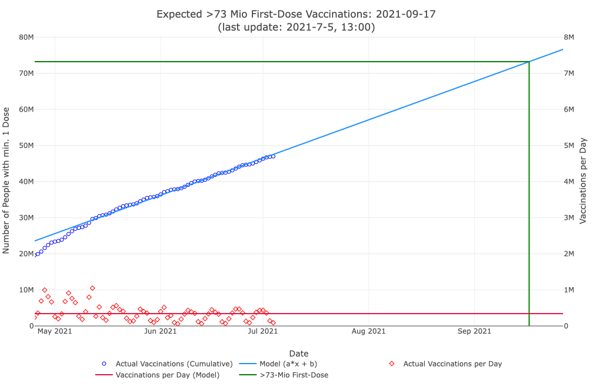

# vax-mod-ger
Vaccination Model for Germany


- Uses a linear fit to predict the progress of first-dose vaccinations in Germany
## Running
The script is tested with Julia 1.6.1.

Use the following command to run it:
```bash
$ julia ./extrapolate.jl
```

The first time it runs, Julia should download all dependencies accordingly.

It outputs a file called `Plot_Vax.html` that contains an interactive plot. Just open it with your browser and make sure to allow Javascript.
